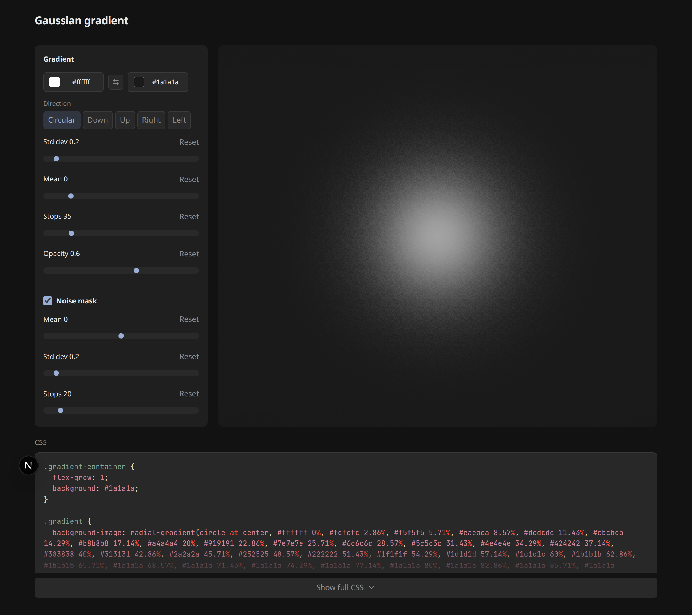
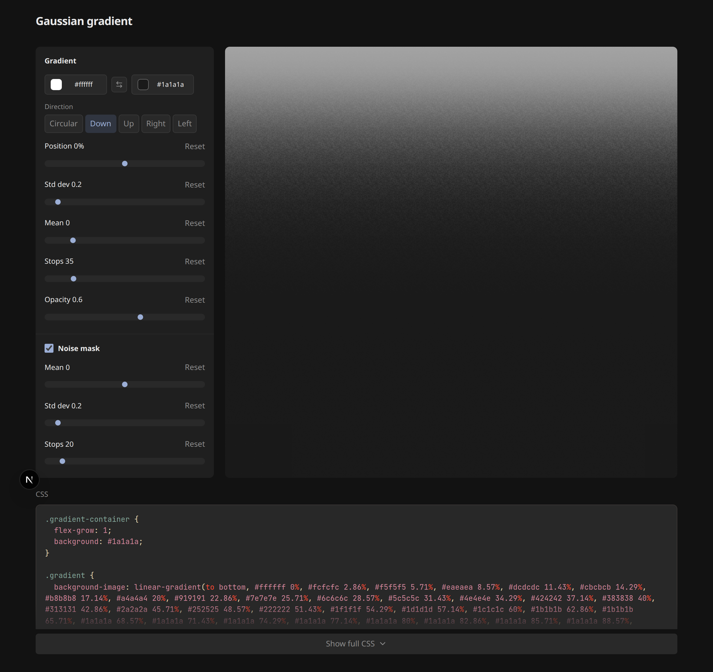
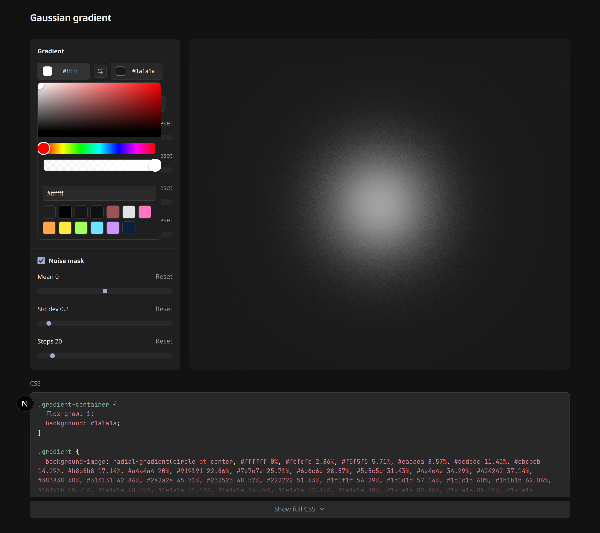
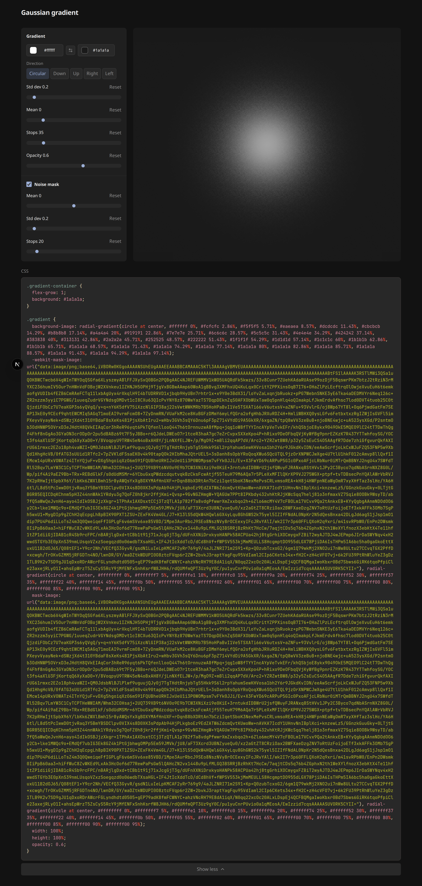

# Gaussian Gradient Generator

Generate smooth, banding-free gradients using a Gaussian distribution — not just linear color stops, but mathematically weighted transitions you can tune in real time.

Pick start and end colors (with alpha), adjust standard deviation and mean to shape the falloff, switch between circular and linear directions, and optionally apply a noise mask for dithering. Copy the generated CSS snippet straight into your project.

## Screenshots

| Circular gradient | Linear gradient |
| --- | --- |
|  |  |

| Color picker | CSS export |
| --- | --- |
|  |  |

Screenshots are generated automatically — see [Regenerating screenshots](#regenerating-screenshots).

## Features

**Gradient controls**

- Gaussian-weighted color stops (std dev, mean, stop count)
- Circular, vertical, and horizontal directions
- Position shift slider for linear modes
- Start/stop color pickers with alpha support and swap control
- Opacity control for the gradient layer

**Noise mask**

- Optional noise mask with its own Gaussian parameters (mean, std dev, stops)
- Reduces visible banding in smooth gradients

**Export**

- Live CSS snippet with Gruvbox-themed syntax highlighting
- Expandable CSS panel on desktop; full-screen modal on mobile
- Copy-paste ready styles for your designs

## How it works

Color stops are placed along the gradient axis and weighted by a Gaussian curve. Each stop's mix ratio between the start and end color is derived from the normalized bell-curve value at that position. A separate mask gradient (also Gaussian-weighted) drives alpha dithering when the noise mask is enabled.

## Tech stack

- Next.js 16
- React 19
- Tailwind CSS 4
- Starry Night for syntax highlighting
- react-colorful for the picker
- Lucide icons

## Development

```bash
pnpm install
pnpm dev
```

Open [http://localhost:3003](http://localhost:3003).

```bash
pnpm build
pnpm start
pnpm lint
pnpm lint:fix
```

## Site icons

Favicons, Open Graph images, and the web manifest are generated from `public/gradient_image.avif`:

```bash
pnpm icons
```

Requires ImageMagick (`magick` or `convert` on your PATH).

## Regenerating screenshots

Install Chromium for Playwright once:

```bash
pnpm screenshots:install
```

The screenshot script also checks for Chromium on first run and installs it only if missing — subsequent runs reuse the cached browser.

Generate all README screenshots:

```bash
pnpm screenshots
```

The script starts a local dev server, drives the UI with Playwright, and writes images to `docs/screenshots/`.

If you already have `pnpm dev` running, reuse it:

```bash
SCREENSHOT_BASE_URL=http://localhost:3003 pnpm screenshots
```

Capture a single screenshot:

```bash
pnpm screenshots radial-gradient.png
```

## License

MIT
